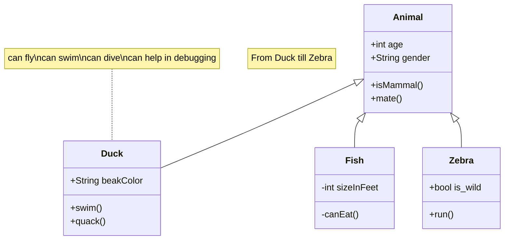

https://github.com/ehsomma/ddd-person-masstransit/blob/ece08e6900b3cd3e58984f80b530f165596183e4/Src/Core/My.System.Extensions/ConfigurationExtensions.cs#L3-L10

[Descripción...](Src/Services/Persons/Records.Persons.Application/Persons/Events/PersonUpdated/PersonUpdatedEventHandler.cs)

[Descripción...](#descripcion)

[Descripción 2...](#descripción-2)

[go to chapter one](#chapter-1)

[Google...](http://google.com)

# Título titulado 1
## Título titulado 1
### Título titulado 1
#### Título titulado 1
##### Título titulado 1

texto `destacado` text

texto *italic* text

texto **bold** text

~~This was mistaken text~~

This is a subscript text

Text that is not a quote

> Text that is a quote

> [!NOTE]
> Useful information that users should know, even when skimming content.

> [!TIP]
> Helpful advice for doing things better or more easily.

> [!IMPORTANT]
> Key information users need to know to achieve their goal.

> [!WARNING]
> Urgent info that needs immediate user attention to avoid problems.

> [!CAUTION]
> Advises about risks or negative outcomes of certain actions.

| First Header  | Second Header |
| ------------- | ------------- |
| Content Cell  | Content Cell  |
| Content Cell  | Content Cell  |

- [x] #739
- [ ] https://github.com/octo-org/octo-repo/issues/740
- [ ] Add delight to the experience when all tasks are complete :tada:
 

# Otro

# Imagenes

eee

SAF safSF
SDF
 ASD
 F
  ASDF
   ASD
   F
    ASD
    F D
    F

ASDFASDF
ASDFASDF
ASDFASDF

ASDF

ASDF
AS
DF
ASDF
### <a id="chapter-1" />Chapter 1

DSAF
ASD
FSAD
F

### Descripción {#descripcion}
Esta es la descrip...

SAF safSF
SDF
 ASD
 F
  ASDF
   ASD
   F
    ASD
    F D
    F

### Descripción 2
ASDFASDF
ASDFASDF
ASDFASDF

ASDF

ASDF
AS
DF
ASDF

DSAF
ASD
FSAD
F