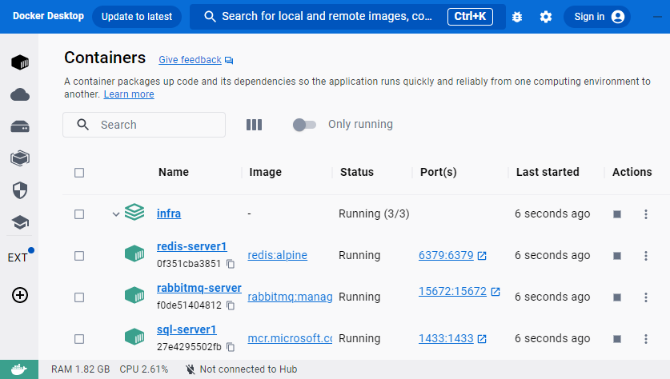
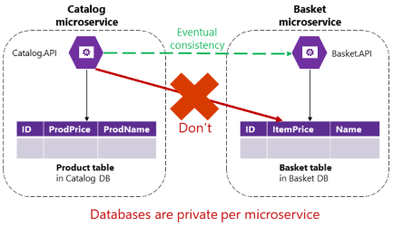

[](https://github.com/ehsomma/ddd-cqrs-microservices/actions/workflows/main.yml)
[](https://coveralls.io/github/ehsomma/ddd-cqrs-microservices?branch=master)
[](https://github.com/ehsomma/ddd-cqrs-microservices/issues)
[](/LICENSE.txt)

# DDD, CQRS and Microservices chronicles<br><sup><sub><sup><sup>by a .Net developer</sup></sub></sup></sup>

(if you are a lazy reader, see: [tl;dr](#tldr))

There are many examples about **DDD** (Domain Driven Design) and **Clean Architecture** (or hexagonal, onion), others about **CQRS**, others about **Microservices**. There are many good and renowned authors on the subject, many different interpretations and implementations and probably, you have not seen two identical examples. Also, all these examples are about isolated topics since you can use DDD without Microservices or CQRS, or Microservices without DDD, etc. 
This makes it challenging for me to make decisions when trying to implement and integrate all these topics together.

In this example you will find how to combine all these architectures, guidelines, definitions and patterns in a 100% working project with a simple business logic.

This is not a "hello world" of DDD nor is it a step-by-step on how to implement it.
What I want to share is how I put all of these concepts together (DDD, Clean Arch., CQRS, etc.), what problems I ran into and what [decisions](#decisions-made) I made based on me and my team preferences and knowledge.

> [!NOTE]
> This is my interpretation and implementation and not the absolute truth, you can agree or not, adopt a more or less purist approach and/or take all the licenses you consider when making your implementation.

<!-- tl;dr -->
## <a id="tldr"/>tl;dr
A working example of DDD with microservices, CQRS and Write and Read databases. This document contains comments about the decisions that we made to select architectures, guidelines, definitions, patterns and tools.  

<!-- Index -->
## Index
* [About the example](#abaut-example)
* [Architectures, guidelines, patterns and used libraries](#architectures)
* [How to run the project](#how-to-run)
* [Decisions made](#decisions-made)
  * [Dapper or Entity Framework (EF)](#dapper-vs-ef)
  * [MediatR library or custom implementation ("vanilla" CQRS)](#mediatr-vs-custom) 💪...🤔
  * [Exceptions or Result<> with Railway Oriented Programming (ROP)](#exceptions-vs-result) (not what you think!)
  * [Automapper, Mapster or manual mapping](#mappers)
  * [Same class name in different namespaces](#aliases)
  * [Nullable or non-nullable value in value objects](#nullable)
  * [Events/Messages properties](#message-metadata)
  * [Inter-service communication](#inter-service)
  * [Domain events, Integration events, or just Events](#domain-vs-integration)
  * [Read and Write databases (**Projection**)](#read-write)
  * [MassTransit with RabbitMQ or just RabbitMQ](masstransit)
  * [Ensures, manual or via library](#ensures)
  * [Analyzers](#analyzers)
  * [Tests and code coverage](#tests)
* [Special thanks](#thanks)

## <a id="abaut-example" />About the example
The project is based on a simple CRUD for registering people represented in a microservice where you can register your personal data, your address, a list of personal assets and another microservice with a CRUD of countries, countries that will be required to assign to the address of the person.

In this way we can demonstrate the interaction between microservices through messages (or integration events). When creating a country in the Countries microservice, it must be replicated in the People microservice. On the other hand, when creating or updating a Person, their address must contain a valid Country, that is, it must have been previously created in the countries microservice.

> [!NOTE]
> The Persons microservice is 100% implemented. The Countries microservice is not 100% implemented, it has the basics (but respecting all the guidelines) to be able to create a Country and demonstrate how to interact between microservices.

> NOTE 2: We use Persons and not People for technical purposes to represent that Persons is a list of Person, something like this looks ugly:

```csharp
List<Person> people = GetPeople(); // Ugly.
List<Person> persons = GetPersons(); // More technically readable.
```	

<!-- Architectures, guidelines, patterns and used libraries -->
## <a id="architectures"/>Architectures, guidelines, patterns and used libraries

### Architectures, guidelines, patterns
* DDD (Domain Driven Design)
* Clean architecture
* CQRS (Command and Query Responsibility Segregation)
* Microservices
* Separate databases (Write and Read)
* Domain events
* Integration events
* Outbox pattern
* Message broker
* Mappers (many mappers!)
* Repository pattern
* Unit of Work
* Unit tests
* Architecture tests
* Code coverage
* Style analyzers
* API
* Background tasks
* Health checks
* Idempotency
* Conflict resolution (Obsolete messages prevention)
* Custom command/connection profiler
* SOLID
* Dependency Injection
* Async programing
* CI (continuous  integration)
* 100% documented API (and sample data) with Swagger
* 100% documented code.
	
### Libraries
* [MediatR](https://github.com/jbogard/MediatR)
* [Dapper](https://github.com/DapperLib/Dapper)
* [FluentValidation](https://github.com/FluentValidation/FluentValidation)
* [FluentAssertion](https://github.com/fluentassertions/fluentassertions)
* [xUnit](https://xunit.net/)
* [MOQ](https://github.com/devlooped/moq)
* [Mapster](https://github.com/MapsterMapper/Mapster)
* [Throw](https://github.com/amantinband/throw)
* [Polly](https://github.com/App-vNext/Polly)
* [MassTransit](https://github.com/MassTransit/MassTransit)
* [Serilog](https://github.com/serilog/serilog)
* [Quartz](https://github.com/quartznet/quartznet)
* [AspNetCore.Diagnostics.HealthChecks](https://github.com/Xabaril/AspNetCore.Diagnostics.HealthChecks)
* [Scrutor](https://github.com/khellang/Scrutor)

### Tools
* Github Actions
* Docker
* RabbitMQ
* Redis
* SQL Server

<!-- How to run the project -->
## <a id="how-to-run"/> How to run the project
### Pre-requisites
* Any version of [Visual Studio](https://dotnet.microsoft.com/en-us/download/dotnet/6.0) with .NET 6.0.
* [Docker](https://www.docker.com/products/docker-desktop/).
SQL Server Management Studio (or similar, just to run some scripts and data view).

### How to run it
1. **Download** this repo [ddd-cqrs-microservices](https://github.com/ehsomma/ddd-cqrs-microservices) from Github.
2. **Open** `Records.sln` solution from Visual Studio.
3. From the terminal, go to the `Infra` folder and execute the next command to **run Docker compose**. It will run `SQL Server`, `Redis` and `RabbitMQ` containers.

	```	
	cd .\Infra\
	docker compose up
	```

	> [!IMPORTANT]
	> Verify that all three servers are up and running.

	

4. **Connect** to the SQL database engine with the next credentials from SQL Server Management Studio:
	```	
	Server: localhost
	User: sa
	Password: Abc#123456
	```
	

5. 	Copy or open the next scripts into SQL Server Management Studio a run them to **create the databases**:
	
	The scripts are in the root folder of the solution accessed through the file explorer or in *Src\Services\Persons|Countries\Infra\DatabaseScripts* (virtual folders).

	* RecordsCountries_Source.sql
	* RecordsPersons_Source.sql
	* RecordsPersons_Projection.sql

6. Open the **solution property pages**, select `Multiple startup projects`, and then change the action to `Start` for the 5 projects showed below:
	
	

7. 	**Run** the solution.<br>
	That will show the Swagger UI of each API and the Health Checker UI.

	<!--  -->
	

8.	As a basic example, **run the next requests** from the Swagger UI to create a Country and then a Person:
	
	1.	From the **Records.Countries API**, execute the `POST /countries` request (with the default sample data) to create a Country:
		
		<!--  -->
		
	
	2.	From the **Records.Persons API**, execute the `POST /persons` request (with the default sample data) to create a Person:
		
		<!--  -->
		

<!-- Decisions made -->
## <a id="decisions-made"/>Decisions made
Here I am not going to go into detail about what each thing is used for (you can see the definitions in the links above). But what I do want to talk about is my experiences with some important decisions and their foundations.

### <a id="dapper-vs-ef"/>Dapper or Entity Framework (EF)
Many use EF and it is perfect, I also used it in a large project and at first everything was ok. But as it grew and we began to need to optimize the queries and see what it was doing underneath, it started to get complicated.<br>
Added to this, (at that time) the '**entity data model**' with its tedious diagram, the '**database-first**' approach, the '**code-first**' approach, plus **migrations** from version 4, then to 5, then to 6, and then EF Core, required changes everywhere and made everything more complicated and difficult to handle.
Before moving on to the EF Core, we reached a point where we decided to stop and we changed to **Dapper**.

My team and I had a lot of experience in T-SQL so it was a liberation!, and now I wouldn't change it for anything. Dapper is fast, simple and super complete and we never had a problem with version changes.

We use 2 additional things to Dapper:
1. [Dapper.Contrib](https://github.com/DapperLib/Dapper.Contrib):

	It contains a number of helper methods for inserting, getting, updating and deleting records.<br>
	Here is an example of "vanilla" Dapper and its optimization with Dapper.Contrib: Ver: [PersonRepository.cs](Src/Services/Persons/Records.Persons.Infra.Persistence.Sql/Persons/Repositories/PersonRepository.cs) in InsertAsync() method (Dapper.Contrib vs Dapper "vanilla").
	
2. A custom connection profiler: 				

	It is a custom wrapper around IDbConnection, which allows us to build a wrapped IDbCommand for logging/debugging or catch commands exceptions. This is necessary since after executing the query, if it fails, there is no way to see the executed query from Dapper. See: [InterceptedDbConnection.cs](Src/Core/My.Data.InterceptableDbConnection/InterceptedDbConnection.cs).

### <a id="mediatr-vs-custom"/>MediatR library or custom implementation ("vanilla" CQRS) 💪...🤔
When I started researching DDD (in .NET), I saw that everyone was using MediatR to implement CQRS and event handlers. So I tried it, implemented it, it worked perfectly and was super easy.
	
But one day, I found a blog from a developer who proposed... "[Why I don't use MediatR for CQRS](https://cezarypiatek.github.io/post/why-i-dont-use-mediatr-for-cqrs)" 
where he argued that MediatR was for something else and was not the best option for CQRS. In contrast, he gave an example of how to do the same thing in a simple and manual way, specific to CQRS and without depending on any library.
So I loved the idea, the rebel inside me came out and I said, yes, let's do it, let's code!!! (new branch "NoMediatR").<br>
I did it and it worked perfect (just with DI and [Scrutor](https://github.com/khellang/Scrutor))! "I don't need any external library for this !!! 💪".
	
Then I wanted to improve it adding Async overloads and comments. Since I knew that MediatR did it, I decided to snoop around its source code 🤔.<br>
There I discovered that its code was exactly the same as mine, but with many more overloads, more optimized and perfectly documented. And I thought… it does the same thing, everyone uses it, everyone knows it, there is documentation everywhere, it is constantly updated. So I put my rebel aside and came back to MediatR ✌.

### <a id="exceptions-vs-result"/>Exceptions or Result<> with Railway Oriented Programming (ROP)
This will be controversial, I know.

In addition to MediatR, I also saw that several people were talking about using Result<T> in function returns to avoid the use of exceptions in the business logic, and again, I got involved!<br>
I discovered that it had a super cool name "`ROP`" (the analogy is so precise), that it was a pattern and that it came from "functional" programming.


I researched from the best sources. Take a look at these excellent documentation links: [ROP](https://fsharpforfunandprofit.com/rop/), [Scott Wlaschin](https://www.youtube.com/watch?v=fYo3LN9Vf_M) (video of the author explaining of ROP), [Milan](https://www.youtube.com/watch?v=KgfzM0QWHrQ&t=618s), [NetMentor](https://www.youtube.com/watch?v=_l5vUf7W09A&t=1s) (Spanish), [Vladimir](https://enterprisecraftsmanship.com/posts/error-handling-exception-or-result/), [Amichai](https://www.youtube.com/watch?v=tZ8gGqiq_IU).<br>
I learned how to use it (you have to do this before making a decision) and implemented it in a project.

These were some things I had to deal with:
* You have to replicate the `Result<>` in all functions. But not in the entire project, just in mmmm 🤔… <br>	
  If you are in a team, you have to make a standard of where and when to use it.
		
* If your function does not return a value (void) you must use Result and not Result<> and this requires writing overloads of the Result, I also saw another implementation using `Result<Unit>`.
		
* If you use async functions, the return type looks something like this: `Task<Result<UserAccount>>`. Ok ok, no problem with that, but…
		
* If it fails, <ins>it does not cut the flow</ins> like exceptions do and from where you call the function you must control whether the execution was a Success or Fail.
		
* And, probably, `this is the most complicated`... As mentioned above, you have to control the result from beginning to end and if you have several functions or nested functions, you have to chain them (with functions like Bind(), Combine(), Map(), Match(), Fallback(), Ignore()) to transmit the result from one to another.
	 
* It is not like other patterns that after implementing it, you use it transparently. This pattern causes you (literaly) to have to <ins>change the way you write your code</ins>.
	
* If you incorporate someone into your team, they must know this pattern, or you must explain it to them very kindly (otherwise it will run away!).

#### Decision
For all this things, and after using it for a while, my decision was to use `exceptions`.
But with some changes like these:

* Custom domain exceptions which adds the Error property to assign the domain error. In turn, these domain errors, through their code and/or group, will be interpreted in the global error handler of the APIs to automatically set the HTTP Status code (see: [DomainException.cs](Src/Services/Shared/Records.Shared.Domain/Exceptions/DomainException.cs) and [Error.cs](Src/Services/Shared/Records.Shared.Domain/Models/Error.cs)).
	
* Custom domain exceptions for validations of aggregates and value objects. It also auto-interprets the HTTP status code (see: [DomainValidationException.cs](Src/Services/Shared/Records.Shared.Domain/Exceptions/DomainValidationException.cs)).
 
* Several extension methods to handle the Error within exceptions (see: [ExceptionExtensions.cs](Src/Core/My.Core.Exceptions/ExceptionExtensions.cs)).
 
* Be very careful not to throw exceptions inside loops.

#### Final thoughts on ROP
The ROP pattern is excellent, it perfectly solves the problem it poses, it is well explained and there is a lot of documentation... but its implementation and daily use are not so simple (at least for me).

Maybe (surely) it's my lack of experience and knowledge of functional programming.
I'm not saying that one option is better than the other, ROP probably is, but I feel much more comfortable and free using exceptions (if you don't mess with them).
I just wanted to share my experience so that it helps you when making a decision.
	
I leave you here an excellent [discussion on Reddit](https://www.reddit.com/r/dotnet/comments/11751gx/exceptions_vs_result_pattern/) where this topic is raised and there are several different opinions:

This answer was the one I felt most identified with:
> …"**`When in Rome, do as the Romans`**, and use exceptions if the framework/codebase you're in is designed around them"…

👏👏👏👏👏	([View Reply](https://www.reddit.com/r/dotnet/comments/11751gx/comment/j9c6y8b/?utm_source=share&utm_medium=web3x&utm_name=web3xcss&utm_term=1&utm_content=share_button))

<sub>NOTE: This is written from the point of view of a .NET developer with c#.</sub>

### <a id="mappers"/>Automapper, Mapster or manual mapping
When using APIs, CQRS, DDD and the Repository pattern you have to use many mappers.
	
Until now I had used [Automapper](https://github.com/AutoMapper/AutoMapper), and although it is simple to use, you have to define the Mapper class with its configuration and I use a little trick to save its configuration in cache.<br>
When using DDD with so many mappers everywhere, I wanted to avoid this and decided to do the mappings manually so that the code is cleaner 💪. For a while I was wondering whether to do it manually or with Automapper, so I did some research on how to optimize Automapper and along the way I discovered [Mapster](https://github.com/MapsterMapper/Mapster).

With Mapster, in addition to being [faster](https://github.com/MapsterMapper/Mapster#why-mapster), you don't have to configure anything! You just use some extensions methods in your classes (except when you have to map properties with different names).

```csharp
// Automapper.
var config = new MapperConfiguration(cfg => cfg.CreateMap<User, UserDto>());
var mapper = config.CreateMapper();

UserDto destination = mapper.Map<UserDto>(source);
```

```csharp
// Mapster.
UserDto destination = source.Adapt<UserDto>();
```

#### Examples

===>

| From                  | To              | Obs., Links                                                 |
|-----------------------|-----------------|-------------------------------------------------------------|
| API Request           | Commands        | See: [CreatePersonRequestMapper.cs](Src/Apps/Records.Persons.Api.V1/Persons/Controllers/CreatePerson/CreatePersonRequestMapper.cs) .FromRequestToCommand()   |
| Commands              | Domain models   | We use factories here like .Create()/.Load(), not mappers   |
| Queries (Application) | Queries (Reads) | See: [GetPersonsWithSpecificProfileQueryHandler.cs](Src/Services/Persons/Records.Persons.Application/Persons/Queries/GetPersonsWithSpecificProfile/GetPersonsWithSpecificProfileQueryHandler.cs) .Handle() |
| Domain models         | Data models     | See: [CountryMapper.cs](Src/Services/Persons/Records.Persons.Infra.Persistence.Sql/Countries/Mappers/CountryMapper.cs) .FromDomainToDataModel()              |


<---

| From           | To              | Obs., Links                                                                                                       |
|----------------|-----------------|-------------------------------------------------------------------------------------------------------------------|
| Data models    | Domain models   | We use .Load() here, not mappers                                                                                  |
| Data models    | Read models     | Here we map directly with Dapper from thew SELECT to a ReadModel. See: GetPersonsWithSpecificProfileRepository.cs |

#### Conclusion
It's a matter of taste here, you can choose any option (Automapper, Mapster, manual or another mapper), mine was Mapster.


### <a id="aliases"/>Same class name in different namespaces
To implement DDD with APIs, CQRS and Read/Write databases (Projection), you probably have **many classes** with the **same name** (with different or the same properties) in different projects and namespaces and even in some cases where you must map, you must use two of these in the same class and method.<br>
This makes reading complicated because if the complete namespace is not used, we do not know where that class belongs out of so many possible places.
	
For example, the `Person` class is repeated in all of these projects detailed below (aliases table). There are several ways to tackle this problem:
1. In classes where there is conflict, use the complete or partial namespace of both Person classes to differentiate them.
2. In classes where there is conflict, use only Person in one, and the complete or partial namespace in the other to differentiate it.
3. In classes where there is conflict, use an Alias for both and in classes where there is no conflict, use only Person.
4. In all classes that use Person, use an Alias even if there is no conflict.
		
Our decision was `number 4`, always use Alias. Since Person, for instance, is used in so many places that one gets lost and thinks "*where is this Person class from?*" In this way the alias makes interpretation much easier for us.
	
Example: DomainModel, DataModel.Person, etc. (See: [PersonMapper.cs](Src/Services/Persons/Records.Persons.Infra.Persistence.Sql/Persons/Mappers/PersonMapper.cs) (Usings), or search for "// Using aliases." in the projects).
	
##### Aliases table
|Project|Namespace|Alias|
|---|---|---|
|Records.Persons.Domain|Records.Persons.Domain.Persons.Models|DomainModel|
|Records.Persons.Dtos (contracts)|Records.Persons.Dtos.Persons|Dto|
|Records.Persons.Infra.Persistence.Sql|Records.Persons.Infra.Persistence.Sql.Persons.Models|DataModel|
|Records.Persons.Infra.Projection.sql|Records.Persons.Infra.Projection.sql.Persons.Models|ReadQuery|
|Records.Persons.Reads|Records.Persons.Reads.Persons.Models|ReadModel|

##### Difficult reading:


##### Correct use:


### <a id="nullable"/>Nullable or non-nullable value in value objects
There are 3 ways in which null values can be implemented in value objects:
	
1. Not allowing null values, setting the Value property on the value object to `non-nullable`.
	
	public <ins>decimal</ins> Value { get; private set; }<br>			
    Example: [Money.cs](Src/Services/Shared/Records.Shared.Domain/ValueObjects/Money.cs), [StreetLine.cs](Src/Services/Persons/Records.Persons.Domain/Persons/ValueObjects/StreetLine.cs).
	
2. allowing null values, setting the Value property on the value object to `nullable`.
	
	public <ins>string?</ins> Value { get; private set; }<br>
    Example: [StreetLine2.cs](Src/Services/Persons/Records.Persons.Domain/Persons/ValueObjects/StreetLine2.cs).
	
3. Allowing `null` directly on value object type `property` on entity:
	
	Person.cs<br>
    public Email<ins>**?**</ins> Email { get; private set; }
		
In this project we have decided to use options `1` and `2` but not 3. In option 2, when we want null values, these value objects must have the HasValue and IsEmpty properties to facilitate their handling in the business logic.

### <a id="message-metadata"/>Events/Messages metadata
When you want to publish the events and begin to analyze what information you want them to contain and how to structure them, several options are presented, such as the following:

1. Simply the event represented in the class name with a property that tells us which aggregate produced that event.
	
2. An interface or base class for events where you already have some properties defined such as EventId, AggregateId, OccurredOn, etc.
	
3. A more advanced one using a Message class, where it has a property for the content (our event) and another property with some **metadata**. This will allow us to handle both domain events and integration events for communication between microservices.

They are all good, what will determine which one to use is what you want to do additionally when handling the event depending on the complexity of your system, if you use microservice or not, if you need more traceability, etc. This is our implementation for events/messages which is based on `option 3`:
See: [Message.cs](Src/Services/Shared/Records.Shared.Messaging/Message.cs), [CommandHandler.cs](Src/Services/Shared/Records.Shared.Application/Handlers/CommandHandler.cs).

We do not publish the event directly, first we construct a `message` (Message<TContent>) where its content is the event itself and the metadata is the data necessary to manage the `OutBox pattern` ([PersonCreatedEventHandler.cs](Src/Services/Persons/Records.Persons.Application/Persons/Events/PersonCreated/PersonCreatedEventHandler.cs), [PublishOutboxJob.cs](Src/Apps/Records.Persons.BackgroundTasks/Tasks/PublishOutboxJob.cs)), the idempotence ( [CountryCreatedConsumer.cs](Src/Services/Persons/Records.Persons.Application/Countries/Consumers/CountryCreatedConsumer.cs) NotYetConsumed()), prevent obsolete ([PersonUpdatedConsumer.cs](Src/Services/Persons/Records.Persons.Application/Persons/Consumers/PersonUpdatedConsumer.cs) NotObsolete()), traceability, etc.


### <a id="inter-service"/>Inter-service communication
There are several ways to communicate between microservices, these are some of them:

1. **Through APIs**: Each microservice manages its own information separately and when this information is required to be consulted, a connection is made via API to obtain and use it (read). But this information will continue to be hosted in its corresponding microservice and microservice 2 will be dependent on microservice 1.
		
2. **Event Notification**: From microservice 1, a message with the integration event is published through a message broker (e.g. RabitMQ). Microservice 2 consumes this message to process it. In this case, the event only contains minimal information about the change, for example, the PersonUpdatedIntegrationEvent event will only contain the ID of the updated person.<br>	
    Then microservice 2 will obtain via API only the necessary data of the Person corresponding to that Id and then store it. In this way, microservice 2 will have the necessary data of the Person of microservice 1, having a total or partial replica, being completely independent of microservice 1. See: [Pattern 1: Event Notification](https://www.youtube.com/watch?v=STKCRSUsyP0&t=893s) (Martin Fowler - video).
	
	This is known as "`eventual consistency`" and to implement it correctly requires some additional actions that we will detail later. See: Domain events, Integration events, or just Events.
	
	<br>	
    Image source: [link](https://learn.microsoft.com/en-us/dotnet/architecture/microservices/architect-microservice-container-applications/distributed-data-management#challenge-3-how-to-achieve-consistency-across-multiple-microservices)
		
3. **Event-carried State Transfer**: This method is similar to Event Notification (also with "`eventual consistency`"), but instead of sending only the Id in the event, it will contain all the necessary data to be transmitted and will not require connecting via API to the other microservice to retrieve the data. See: [Pattern 2: Event-carried](https://youtu.be/STKCRSUsyP0?t=942) State Transfer (Martin Fowler - video).
		
Which one is better... For microservices to be independent, the best options are 2 and 3. And to determine which one to use among these 2 will depend on the amount of information to be transported within the event and the number of concurrent events received.
For our project, undoubtedly  the best option is option 3 (because the amount of data is minimal), however, for educational purposes we use option 2 to show how you can connect via API.

### <a id="domain-vs-integration"/>Domain events, Integration events, or just Events
	
"*Semantically, domain and integration events are the same thing: notifications about something that just happened. <ins>However, their implementation must be different</ins>. Domain events are just messages pushed to a domain event dispatcher, <ins>which could be implemented as an **in-memory mediator based**</ins> on an IoC container or any other method.*

*On the other hand, the purpose of integration events is to propagate committed transactions and updates to additional subsystems, whether they are other microservices, Bounded Contexts or even external applications. Hence, they should occur only if the entity is successfully persisted, otherwise it's as if the entire operation never happened.*".<br>
Source: [Microsoft on Microservices](https://learn.microsoft.com/en-us/dotnet/architecture/microservices/microservice-ddd-cqrs-patterns/domain-events-design-implementation#domain-events-versus-integration-events).

We decided to follow the above documentation precisely, using synchronous `domain events` (with MediatR) and asynchronous `integration events` (with MassTransit/RabbitMQ) with "eventual consistency." However, you can use both domain and integration events asynchronously with eventual consistency.<br>
What we do is handle both domain and integration events using messages, as explained in: [Events/Messages properties](#message-metadata).
	
#### Integration events considerations (eventual consistency)
I wish it were as simple as renaming DomainEvent to IntegrationEvent and that's it, but no! When using asynchronous integration events through a message broker, you need to keep the following in mind:

* **Outbox pattern**<br>
When you publish a message to the message broker, you cannot publish it and that's it, it is a service, so it may be inactive, and if it fails when publishing you cannot simply forget it. To solve this problem  what we use is the Outbox Pattern. This allows us that if the publish fails, we can have retries and have better control over failures. See: [PersonCreatedEventHandler.cs](Src/Services/Persons/Records.Persons.Application/Persons/Events/PersonCreated/PersonCreatedEventHandler.cs).
		
* **Idempotency**<br>
Distributed systems may experience temporary failures or network interruptions. In these cases, events can be delivered more than once. Idempotence ensures that if an event is processed multiple times, the final result is the same. This prevents unwanted side effects and ensures consistency. See: [CountryCreatedConsumer.cs](Src/Services/Persons/Records.Persons.Application/Countries/Consumers/CountryCreatedConsumer.cs) NotYetConsumed().
		
* **Resilience**<br>
Even if the Outbox was able to successfully publish to the message broker, consuming the message may fail. There you should also consider taking a resilience policy. See: [DependencyInjection.cs](Src/Services/Shared/Records.Shared.Infra.MessageBroker.MassTransit.DI/DependencyInjection.cs) AddMessageBrokerWithMassTransit() L:114 for global configuratios and [PersonCreatedConsumerDefinition.cs](Src/Apps/EmailService/Consumers/PersonCreatedConsumerDefinition.cs) for especific configuration.
		
* **Conflict resolution**<br>
There are several ways to deal with this, for our case, we decided to use "Obsolete check" (or "last writer wins"). For more options see: https://en.wikipedia.org/wiki/Eventual_consistency (Conflict resolution).
	
	It's easier to explain it with an example. Imagine that user 1 updates the state of an entity (message 1), and then the user updates the state again (message 2). But just when processing message 1, the microservice in charge was down for a few seconds. Message 1, due to the retry policy, waits for a few seconds but message 2 is processed first. Then message 1 is processed correctly. In this case, message 1 would override message 2, which is the one with the latest information. To avoid this, you must verify that the message is not obsolete. See: [PersonUpdatedConsumer.cs](Src/Apps/Records.Persons.BackgroundTasks/Consumers/PersonUpdatedConsumer.cs) Consume(), NotObsolete().
		
* **Eventual consistency**<br>
As we mentioned before, when publishing and consuming asynchronous events, the information is not recorded immediately, which is why "eventual consistency" must be considered. Perhaps, after executing a command, from the UI you want to consult certain information and the information is not yet available. See: [How to achieve consistency across multiple microservices](https://learn.microsoft.com/en-us/dotnet/architecture/microservices/architect-microservice-container-applications/distributed-data-management#challenge-3-how-to-achieve-consistency-across-multiple-microservices).
		
* **Error handling/dead letter**<br>
See: [Strategies to handle partial failure](https://learn.microsoft.com/en-us/dotnet/architecture/microservices/implement-resilient-applications/partial-failure-strategies), [Handling the failure of a single Microservice](https://www.linkedin.com/pulse/handling-failure-single-microservice-navis-michael-bearly-j/).

### <a id="read-write"/>Read and Write databases (Projection)
In this project, we use 2 databases, one for Writing and one for Reading. After persisting the aggregates in the writing database, we publish an integration event which, when consumed, projects the data pertinent to the event in the reading database. In this project, for educational purposes, the data is projected with the same structure as in the writing database and also in a flattened/denormalized way with the necessary information to avoid joins in read operations.
	
> [!NOTE]
> Projecting data into a read database is to improve performance in queries made from the UI and thus free the write database (Source) from constant reads. Even with more performant readings since by having flattened data we avoid joins. In this way, we directly connect the queries with the ReadRepositories that return **ReadModels**. See: [GetPersonByIdQueryHandler.cs](Src/Services/Persons/Records.Persons.Application/Persons/Queries/GetPersonById/GetPersonByIdQueryHandler.cs), [GetPersonByIdRepository.cs](Src/Services/Persons/Records.Persons.Infra.Reads.sql/Persons/GetPersonById/GetPersonByIdRepository.cs), [ReadModel.PersonSummary.cs](Src/Services/Persons/Records.Persons.Infra.Projection.sql/Persons/Models/PersonSummary.cs).


The task of projecting corresponds to infrastructure and not to the business (Domain). Domain-related operations (commands, domain services) should not query or depend on data projection.
See: [Projector.cs](Src/Services/Shared/Records.Shared.Infra.Projection/Projector.cs),
[PersonProjector.cs](Src/Services/Persons/Records.Persons.Infra.Projection.sql/Persons/Projectors/PersonProjector.cs).

##### Projection flow diagram


> Note: You can use an API with writing and reading operations or better, or you can build two separate APIs, one for writing operations and another for reading operations.

### <a id="masstransit"/>MassTransit with RabbitMQ or just RabbitMQ
We started using RabbitMQ as a message broker, I'll be honest, simply because of popularity. Then we discovered [MassTransit](https://masstransit.io). MassTransit is a tool that allows you to abstract from the message broker, simply with an initial configuration, you can use RabbitMQ, Azure Service Bus, and Amazon SQS, Kafka, etc. It's free and the technical support is amazing!

### <a id="ensures"/>Ensures, manual or via library
One of the most important points of DDD (if not the most important) is that the domain must always be in a valid state.
To do this, when creating an instance of an aggregate or value object, we must validate the data to build it.
This validation can be done manually, but in our case we use a library. We originally used [Guard](https://github.com/safakgur/guard), but although it still works, the author recently discontinued it. That's why we found the [Throw](https://github.com/amantinband/throw) library which, in my opinion, is excellent! See: [StringValueObject.cs](Src/Services/Shared/Records.Shared.Domain/ValueObjects/StringValueObject.cs) EnsureIsValid() L:108.

### <a id="analyzers"/>Analyzers
I think it is very important that the entire developer team is consistent with standards and code style. This is why we use all the .NET source code analysis rules and also StyleCop.Analyzers with some custom configurations. See: [.editorconfig](.editorconfig).

In CI we set warnings to be `treated as errors` so that commits that do not comply with the rules are not allowed.

### <a id="tests"/>Tests and code coverage
While the purpose of this example is not code coverage, we wrote the following tests to serve as a guide. Also, in the CI, we run these tests and generate a `code coverage report`.

* Architecture test. See: [ApplicationTests.cs](Src/Services/Persons/Persons.Tests.ArchitectureTests/ApplicationTests.cs), etc.
* Unit tests. See: [CreatePersonCommandHandlerTests.cs](Src/Services/Persons/Persons.Tests.UnitTests/Persons/Commands/CreatePersonCommandHandlerTests.cs).
* Code coverage:

<!-- Special thanks -->
## <a id="thanks"/>Special thanks
I gained all the knowledge from books, courses, but especially, from blogs and videos of developers community who contribute their knowledge, and I couldn't stop to mention them:

> NOTE: This does not mean that what is implemented in this project exactly represents your opinions.

* [Eric Evans](https://twitter.com/ericevans0?lang=en), [Robert C. Martin](https://twitter.com/unclebobmartin), [Martin Fowler](https://twitter.com/martinfowler).
* **Milan Jovanović**: Excellent YouTube channel focused on .NET, architecture and DDD. https://www.youtube.com/@MilanJovanovicTech.
* **NetMentor**: Programming, .NET and distributed systems (Spanish). https://www.youtube.com/@NetMentor
* **CodelyTV**: A lot about DDD and clean architecture (Spanish): https://www.youtube.com/@CodelyTV
* **Amichai Mantinband**: The creator of Throw library! https://www.youtube.com/@amantinband
* **Damián Eiff**: The person who started me and motivated me to use DDD. https://www.linkedin.com/in/damianeiff/ 
